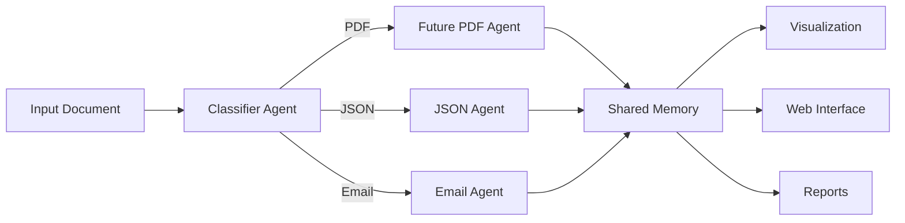

# Multi-Agent AI System for Intelligent Document Routing

A comprehensive system of intelligent agents that classifies, processes, and routes documents based on their format and intent, with visualization capabilities and a user-friendly web interface.

## Overview

This system is designed to handle different types of documents (PDF, JSON, Email), detect their intent (Invoice, RFQ, Complaint, etc.), and route them to specialized agents for processing. All extracted information is logged in a shared memory component for traceability and reporting.

### Key Features

* **Multi-Agent Architecture**: Specialized agents for different document types and processing tasks
* **Intelligent Classification**: Automatic detection of document format and business intent
* **Shared Memory System**: Centralized storage for document context and processing history
* **Web Interface**: User-friendly Streamlit application for document processing and visualization
* **Visualization & Reporting**: Interactive charts and reports for processing analytics
* **Extensible Design**: Easy to add new document types, intents, and specialized agents

## Architecture



### Core Components

- **Classifier Agent**: Detects document format and intent, then routes to specialized agents
- **Email Agent**: Processes email content, extracts sender, subject, urgency, contacts, dates, and amounts
- **JSON Agent**: Validates JSON against schemas, extracts essential fields, and flags missing or anomalous data
- **Shared Memory**: SQLite-based storage system that maintains context across the processing pipeline

### User Interface Components

- **Streamlit Web App**: Interactive interface for document upload, processing, and visualization
- **Visualization Module**: Generates charts and graphs for document processing analytics
- **Reporting System**: Creates HTML reports with interactive visualizations

## Installation

1. Clone this repository
2. Install dependencies:
   ```
   pip install -r requirements.txt
   ```

## Usage

### Web Interface

The system now includes a Streamlit web interface for easy interaction:

```
# Run the web interface
streamlit run app.py
```

Or simply double-click the `run_app.bat` file.

### Process a single document

```python
from main import MultiAgentSystem

system = MultiAgentSystem()
result = system.process_document("path/to/document")
print(result)
```

### Process a batch of documents

```python
from main import MultiAgentSystem

system = MultiAgentSystem()
results = system.process_batch("path/to/directory")
print(results)
```

### Run from command line

```
python main.py --input path/to/document
```

or

```
python main.py --batch path/to/directory
```

### Run Demo

To run a demonstration of the system processing all sample files:

```
python run_demo.py
```

Or simply double-click the `run_demo.bat` file.

### Generate Reports

To generate a visual report of processing statistics:

```
python generate_report.py
```

Or simply double-click the `generate_report.bat` file.

## Sample Inputs

The `inputs/` directory contains sample documents for testing:

- `sample_email.txt`: A sample email with an RFQ request
- `sample_invoice.json`: A sample JSON invoice
- `sample_complaint.json`: A sample customer complaint in JSON format
- `sample_invoice_template.txt`: A text template for invoice PDF generation

## Outputs

Processed documents generate the following outputs in the `outputs/` directory:

- Individual document JSON logs
- Combined logs for batch processing
- SQLite database with processing history
- Processing logs
- Visual reports with charts and statistics

## Visualization and Reporting

The system includes comprehensive visualization and reporting capabilities:

### Interactive Web Dashboard

The Streamlit web interface provides real-time visualization of:
- Document processing history and status
- Detailed view of extracted fields and metadata
- Agent routing history and decision logs
- System processing logs

### Automated Reports

The reporting system generates HTML reports with:
- Document format distribution pie charts
- Intent classification bar charts
- Processing timeline trend analysis
- Agent routing statistics
- Tabular data of processing results

### Data Export

All processing results can be exported as:
- Individual JSON files per document
- Combined JSON logs for batch processing
- SQLite database for advanced querying
- Visual HTML reports

## Extending the System

### Adding a new Agent

1. Create a new agent file in the `agents/` directory
2. Implement the agent's processing logic
3. Update the classifier agent to route to your new agent

Example for a new PDF Agent:

```python
# agents/pdf_agent.py
class PDFAgent:
    def __init__(self, memory):
        self.memory = memory
        
    def process(self, thread_id, content, metadata):
        # Extract text from PDF
        # Process based on intent
        # Log extracted fields
        pass
```

### Adding new Intent Detection

Modify `utils/intent_detection.py` to add new intent detection rules or integrate with an LLM.

Example for adding a new "Contract" intent:

```python
# Add to INTENT_KEYWORDS dictionary
INTENT_KEYWORDS.update({
    "contract": [
        "agreement", "contract", "terms", "conditions", 
        "parties", "legal", "binding", "signature"
    ]
})
```

## Future Development

The system is designed for easy extension. Planned enhancements include:

### Short-term (1-2 weeks)

- Implement PDF Agent for processing PDF documents
- Add more comprehensive test suite with edge cases
- Enhance web interface with filtering and search capabilities

### Medium-term (1-2 months)

- Integrate with Redis for scalable shared memory
- Implement LLM-based intent detection using OpenAI API
- Add support for more document formats (Word, Excel, etc.)
- Create API endpoints for integration with other systems

### Long-term Vision

- Implement machine learning for automatic field extraction
- Add document clustering and similarity search
- Create a feedback loop for continuous improvement
- Develop a full-featured document management system

## Dependencies

- Python 3.10+
- pdfplumber and PyMuPDF for PDF processing
- email.parser for email processing
- jsonschema for JSON validation
- sqlite3 for shared memory (default)
- redis for alternative shared memory (optional)
- openai for optional LLM intent detection
- streamlit and pandas for web interface
- matplotlib for visualization

## License

MIT

## Contact

For questions or feedback, please contact: soham.shah@flowbitai.com
